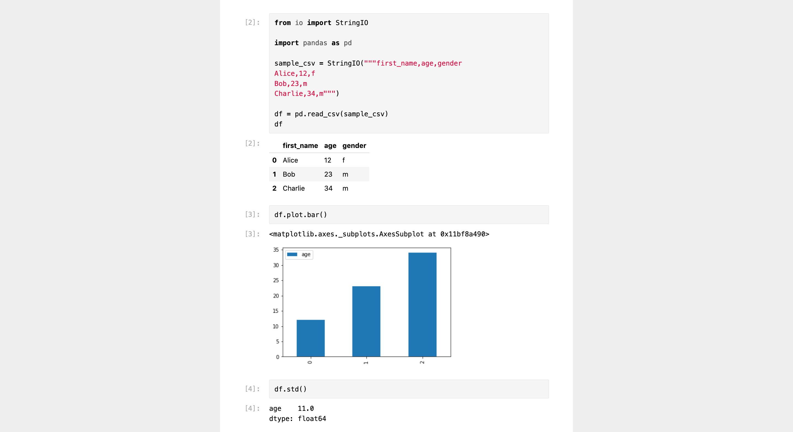

# nbtohtml

**`nbtohtml` is a Go library and CLI for rendering Jupyter Notebooks as HTML.**

**Advantages over similar libraries** like [`notebook.js`](https://github.com/jsvine/notebookjs) or [`nbviewer.js`](https://github.com/kokes/nbviewer.js):

- Built for server-side rendering (no DOM required)
- Comes with built-in Markdown rendering and syntax highlighting
- Implemented in Go for speed and portability
- Sample styles support light and dark mode
- Output is sanitized to prevent code injection

## Example

→ [Example of a rendered notebook](https://nbtohtml.samuelmeuli.com)



## Usage

### As a CLI

#### Pre-compiled

1. Download the latest binary from the [Releases page](https://github.com/samuelmeuli/nbtohtml/releases/latest)
2. Run `./nbtohtml convert /path/to/your/notebook.ipynb` in the directory where you've downloaded the program

#### Self-compiled

1. Compile and install the program by running `go get -u github.com/samuelmeuli/nbtohtml/cmd/nbtohtml`
2. Run `nbtohtml convert /path/to/your/notebook.ipynb`

### As a library

1. Install `nbtohtml` as a dependency in your Go project: `go get -u github.com/samuelmeuli/nbtohtml`
2. Use the library in your code:

```go
notebookHTML := new(bytes.Buffer)
notebookPath := "/path/to/your/notebook.ipynb"
err := nbtohtml.ConvertFile(notebookHTML, notebookPath)
```

## Styles

`nbtohtml` generates HTML tags without inline styles, but with class names. This allows you to style the notebook according to your needs. You will probably want to include some of the following stylesheets in your HTML:

- **Jupyter Notebook styles**: Styles for the Jupyter Notebook (e.g. cell formatting). You can find a sample stylesheet [here](./examples/nbtohtml/notebook.css).
- **Chroma styles**: `nbtohtml` internally uses [Chroma](https://github.com/alecthomas/chroma) for syntax highlighting, which supports [various themes](https://xyproto.github.io/splash/docs). You can find a sample stylesheet [here](./examples/nbtohtml/chroma.css).

## LaTeX Math

Rendering of LaTeX math must be done on the client side. Various libraries exist, [KaTeX](https://katex.org) is a great option. You only need to [link to the KaTeX scripts/styles](https://katex.org/docs/browser.html), and LaTeX math will automatically be rendered after your web page has loaded.

## Contributing

Suggestions and contributions are always welcome! Please discuss larger changes via issue before submitting a pull request.
